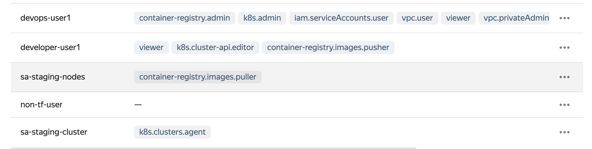

# Настройка ролевого доступа - часть первая , настройка IAM


Изучим main.tf файл текущего терраформ. В нем в разных модулях настраиваются роли для разных групп пользователей. Так как в API yandex.cloud групп пока нет, то сделаем группы самостоятельно с помощью terraform - запишем это в переменную user_group_mapping.

Чтобы это сделать запустим команды ниже. 
```

DEVOPS_USER_ID=$(yc iam service-account get --name=devops-user1  --folder-id=$STAGING_FOLDER_ID --profile=prod --format=json | jq -r .id |  (echo -n serviceAccount: && cat))
DEVELOPER_USER_ID=$(yc iam service-account get --name=developer-user1  --folder-id=$STAGING_FOLDER_ID --profile=prod --format=json | jq -r .id |  (echo -n serviceAccount: && cat))

cat > terraform.tfvars <<EOF
user_group_mapping = { 
    devops = ["${DEVOPS_USER_ID}",]
    developers = ["${DEVELOPER_USER_ID}", ]
}
prod_folder_id="${PROD_FOLDER_ID}"
staging_folder_id="${STAGING_FOLDER_ID}"
EOF


```

Проверим что создали верный файл

```
$cat terraform.tfvars
user_group_mapping = { 
    devops = ["serviceAccount:ajeipuill21dgnot390t",]
    developers = ["serviceAccount:ajelrgfrac12re9quhkg", ]
}
prod_folder_id="b1g1tu3mtucardlr6nc0"
staging_folder_id="b1gcpl9un0ccqrjcup0r"
```


Запустим терраформ 


```
export YC_TOKEN=$(yc iam create-token --profile=default)
$ terraform init
$ terraform apply
```
Вам предложат создать 6 сущностей - 4 SA и 2 policy

В случае успеха они и создадутся
```

module.staging_folder.yandex_iam_service_account.sa["sa-staging-cluster"]: Creation complete after 2s [id=ajetbqaqn0l34tfp0pcv]
module.prod_folder.yandex_iam_service_account.sa["sa-prod-cluster"]: Creation complete after 3s [id=aje7p66ait1cfjieoqdm]
module.staging_folder.yandex_iam_service_account.sa["sa-staging-nodes"]: Creation complete after 3s [id=ajeioqi3thcf1pccvk5u]
module.prod_folder.yandex_iam_service_account.sa["sa-prod-nodes"]: Creation complete after 4s [id=aje7orvno1e1g2npvij5]
module.staging_folder.yandex_resourcemanager_folder_iam_policy.folder_bindings_policy[0]: Creation complete after 2s [id=b1gcpl9un0ccqrjcup0r]
module.prod_folder.yandex_resourcemanager_folder_iam_policy.folder_bindings_policy[0]: Creation complete after 2s [id=b1g1tu3mtucardlr6nc0]

```

В консоли стейджингового фолдера вы увидите что sa devops-user-1 и deveveloper-user1 появились роли , и также появились сервисные аккаунты с нужными ролями





Посмотрим что происходит в выводах cli

```
$ yc resource-manager folder list-access-bindings --id=$PROD_FOLDER_ID --profile=prod
+----------------------------------+----------------+----------------------+
|             ROLE ID              |  SUBJECT TYPE  |      SUBJECT ID      |
+----------------------------------+----------------+----------------------+
| vpc.user                         | serviceAccount | ajeipuill21dgnot390t |
| viewer                           | serviceAccount | ajelrgfrac12re9quhkg |
| k8s.clusters.agent               | serviceAccount | aje7p66ait1cfjieoqdm |
| vpc.privateAdmin                 | serviceAccount | ajeipuill21dgnot390t |
| k8s.admin                        | serviceAccount | ajeipuill21dgnot390t |
| iam.serviceAccounts.user         | serviceAccount | ajeipuill21dgnot390t |
| k8s.cluster-api.cluster-admin    | serviceAccount | ajeipuill21dgnot390t |
| container-registry.admin         | serviceAccount | ajeipuill21dgnot390t |
| container-registry.images.puller | serviceAccount | aje7orvno1e1g2npvij5 |
| viewer                           | serviceAccount | ajeipuill21dgnot390t |
+----------------------------------+----------------+----------------------+

$ yc resource-manager folder list-access-bindings --id=$STAGING_FOLDER_ID --profile=prod
+----------------------------------+----------------+----------------------+
|             ROLE ID              |  SUBJECT TYPE  |      SUBJECT ID      |
+----------------------------------+----------------+----------------------+
| iam.serviceAccounts.user         | serviceAccount | ajeipuill21dgnot390t |
| container-registry.images.pusher | serviceAccount | ajelrgfrac12re9quhkg |
| k8s.admin                        | serviceAccount | ajeipuill21dgnot390t |
| vpc.privateAdmin                 | serviceAccount | ajeipuill21dgnot390t |
| k8s.cluster-api.cluster-admin    | serviceAccount | ajeipuill21dgnot390t |
| k8s.clusters.agent               | serviceAccount | ajetbqaqn0l34tfp0pcv |
| container-registry.images.puller | serviceAccount | ajeioqi3thcf1pccvk5u |
| k8s.cluster-api.editor           | serviceAccount | ajelrgfrac12re9quhkg |
| viewer                           | serviceAccount | ajelrgfrac12re9quhkg |
| container-registry.admin         | serviceAccount | ajeipuill21dgnot390t |
| vpc.user                         | serviceAccount | ajeipuill21dgnot390t |
| viewer                           | serviceAccount | ajeipuill21dgnot390t |
+----------------------------------+----------------+----------------------+
```

У нас все получилось!

Переходим к  созданию кластера k8s. Чтобы это сделать, передадим в терраформ стейнджинг инфрастурктуры id созданных тут сервисных аккаунтов ( для целей демо)


```
cat > ../staging/terraform.tfvars <<EOF
cluster_sa_id = $(terraform output -json | jq .staging_cluster_sa.value)
nodes_sa_id = $(terraform output -json | jq .staging_nodes_sa.value)
folder_id="${STAGING_FOLDER_ID}"
EOF
```

И перейдем в 

```
cd ../staging/
```

и продолжим [демо](../staging/)