# Развёртывание IPsec VPN в Yandex Cloud с помощью шлюза безопасности

Оглавление:
* [Введение](#overview)
* [Топология и основные элементы решения](#sgw-topology)
* [Параметры IPsec протокола](#sgw-ipsec)
* [Особенности реализации шлюза безопасности YC-SGW](#sgw-details)
* [Описание развёртывания решения с помощью Terraform модуля](#sgw-tf)
* [Создание конфигурационного файла для Remote-SGW](#remote-config)
* [Выполнение Terraform развёртывания](#sgw-tf-apply)
* [Спецификация модуля](#spec)


## Введение <a id="overview"/></a>

Информационные сервисы имеют свой жизненный цикл. Они постоянно эволюционируют и изменяются. Для роста им необходимы ресурсы. В традиционных корпоративных ЦОД процесс развёртывания новых ИТ-ресурсов занимает много времени. Облака позволяют расширять границы ЦОД быстро и практически безгранично.

При размещении части ресурсов в облаке им необходимо обеспечить защищённое сетевое взаимодействие с уже работающими в корпоративном ЦОД ресурсами. Для решения этой задачи применяется технология создания защищенных соединений между корпоративным ЦОД и облачной инфраструктурой.

Инфраструктура ЦОД и облачная инфраструктура объединяются в одно информационное пространства с помощью технологий для построения виртуальных сетей (VPN), такими как [IPsec](https://www.ietf.org/rfc/rfc2401.txt), [WireGuard](https://www.wireguard.com/), и т.д.

В данном документе описано решение шлюза безопасности (Security Gateway) для организации защищённого соединения на базе протокола `IPsec` между корпоративным ЦОД и облачной инфраструктурой в `Yandex Cloud` через сеть Интернет.

Выбор протокола IPsec обусловлен его широкой поддержкой в различных сетевых устройствах (как физических так и виртуальных) от множества производителей.

В качестве шлюза безопасности для данного решения был выбран продукт с открытым исходным кодом [strongSwan](https://github.com/strongswan/strongswan).


## Топология и основные элементы решения <a id="sgw-topology"/></a>

Пример обычной топологии `IPsec site to site VPN` - защищённого IPsec соединения между корпоративным ЦОД и облачной инфраструктурой в Yandex Cloud показан на схеме ниже:

<p align="center">
    
</p>

В облачной инфраструктуре Yandex Cloud есть подсети subnet-1, subnet-2 и subnet-3 в которых расположена одна часть информационных ресурсов.

В ЦОД `Remote site` есть подсети subnet-5 subnet-6 в которых расположена другая часть информационных ресурсов.

Шлюзы безопасности YC-SGW и Remote-SGW объединяют вышеперечисленные сегменты сети с помощью `IPsec Tunnel`, который строиться через сеть Интернет. Шлюзы безопасности выполняют функции по передаче трафика и его шифрованию при передаче в соседний сегмент сети через IPsec туннель.


Ниже описаны наболее важные объекты, показанные на схеме:

* `YC-SGW` - шлюз безопасности в Yandex Cloud - это ключевой элемент этого решения. Шлюз безопасности развёртывается в формате ВМ на базе продукта с открытым исходным кодом [strongSwan](https://docs.strongswan.org/). Работа IPsec туннеля обеспечивается согласованной работой шлюза безопасности YC-SGW и удаленного шлюза безопасности Remote-SGW в ЦОД. Шлюз безопасности YC-SGW развёртывается в выделенной подсети `subnet-4` в Yandex Cloud. Использование отдельной подсети для развёртывания YC-SGW позволяет избежать зацикливаний трафика при маршрутизации в определенных сценариях использования.

* `Remote-SGW` - шлюз безопасности в ЦОД. В данном примере шлюз безопасности реализован на базе аппаратного или программного маршрутизатора компании [Cisco](https://www.cisco.com) с операционной системой `Cisco IOS-XE`.

* `Network-1` - [облачная сеть](https://cloud.yandex.ru/docs/vpc/concepts/network#network) в облачном каталоге Yandex Cloud.

* `subnet1`, `subnet2` и `subnet3` - [подсети в облачной сети](https://cloud.yandex.ru/docs/vpc/concepts/network#subnet). Каждая подсеть создана в своей [зоне доступности](https://cloud.yandex.ru/docs/overview/concepts/geo-scope). В подсетях развёрнуты облачные ресурсы (cloud resources), которым нужно взаимодействовать с ресурсами в ЦОД (on-prem resources).

* `subnet-5` и `subnet-6` - подключены к Remote-SGW через логические интерфейсы *(sub-interfaces Gig1.11 и Gig1.12)* одного физического транкогового порта "Gig1". Информация о конфигурации сетевых интерфейсов шлюза безопасности показана на схеме в таблице **Remote-SGW interfaces**.

* `sgw-rt` - [таблица маршрутизации](https://cloud.yandex.ru/docs/vpc/concepts/static-routes) в облачной сети Network-1. Обеспечивает маршрутизацию трафика в направлении подсетей subnet-5 и subnet-6 через шлюз безопасности YC-SGW. Для включения таблицы маршрутизации в работу её обязательно нужно привязать к подсетям (subnet-1, subnet-2 и subnet-3).

* `YC-SGW route table` - это общая таблица маршрутизации внутри Linux ВМ YC-SGW. В эту таблицу добавляются маршруты для подсетей subnet-5 и subnet-6. Трафик к этим подсетям будет передаваться через IPsec туннель.

* `Remote-SGW route table` - таблица маршрутизации шлюза безопасности Remote-SGW. В эту таблицу добавляются маршруты к подсетям в Yandex Cloud: subnet-1, subnet-2 и subnet-3. Трафик к этим подсетям будет передаваться через IPsec туннель.


## Параметры IPsec протокола <a id="sgw-ipsec"/></a>

Для работы IPsec соединения требуется настройка согласованного набора параметров (`IPsec Policy`) на шлюзах безопасности с обоих сторон соединения. В данном решении используются следующие параметры:

* `policy_name` - имя IPsec политики / профиля.

* `ike_proposal` - [Internet Key Exchange Version 2 (IKEv2)]((https://docs.strongswan.org/docs/5.9/howtos/ipsecProtocol.html#_internet_key_exchange_version_2_ikev2)). Шифр (cipher), который будет использоваться для шифрования канала управления IPsec соединением.

* `esp_proposal` - [Encapsulating Security Payload](https://docs.strongswan.org/docs/5.9/howtos/ipsecProtocol.html#_encapsulating_security_payload_esp). Шифр (cipher), который будет использоваться для шифрования передаваемых данных.

* `psk` - [Pre-Shared Key](https://docs.strongswan.org/docs/5.9/howtos/ipsecProtocol.html#_psk_based_authentication). Ключ (пароль), который будет использоваться для установления IPsec соединения.

Для значений параметров "ike_proposal" и "esp_proposal" используется [нотация strongSwan](https://docs.strongswan.org/docs/5.9/config/IKEv2CipherSuites.html).

В данном примере используются следующие значения параметров IPsec Policy:
```yml
policy_name: yc-ipsec
ike_proposal: aes128gcm16-prfsha256-ecp256
esp_proposal: aes128gcm16
psk: Sup#erPa85s
```

Ознакомится с основными принципами работы протокола IPsec можно в документе [IPsec Protocol](https://docs.strongswan.org/docs/5.9/howtos/ipsecProtocol.html).


## Особенности реализации шлюза безопасности YC-SGW <a id="sgw-details"/></a>

Шлюз безопасности YC-SGW реализован в виде образа ВМ в состав которого входят следующие компоненты:
* Ubuntu Linux 22.04
* Docker Daemon, Docker Client
* Docker контейнер [strongSwan](https://github.com/strongswan/strongswan). Контейнер доступен для загрузки по следующей ссылке: `cr.yandex/crpjfmfou6gflobbfvfv/strongswan:5.9.9`

Работа с сетью внутри шлюза безопасности YC-SGW имеет ряд особенностей:

* ВМ имеет только один сетевой интерфейс - eth0, который подключается к виртуальной сети Yandex Cloud. IP-адрес на этом сетевом интерфейс является шлюзом (next-hop) для маршрутов к подсетям subnet-5 и subnet-6 из подсетей subnet-1, subnet-2 и subnet-3. Через этот же сетевой интерфейс трафик направляется в Интернет через подсистему 1:1 NAT виртуальной сети Yandex Cloud.

* в ВМ разрешается маршрутизация пакетов на уровне ядра (`IP Forwarding`).

* в ВМ отключается протокол IPv6.

* при запуске контейнера `strongSwan` в него пробрасывается [сеть хоста (ВМ)](https://docs.docker.com/network/host/).

* для удобства эксплуатации шлюза безопасности, контейнер `strongSwan` настраивается на работу в режиме [Route-based VPN](https://docs.strongswan.org/docs/5.9/features/routeBasedVpn.html). Для этого в ВМ создаётся [XFRM интерфейс](https://docs.strongswan.org/docs/5.9/features/routeBasedVpn.html#_xfrm_interfaces_on_linux). В результате в YC-SGW появляется дополнительный виртуальный сетевой интерфейс `ipsec0`, через который можно направлять трафик в IPsec туннель с помощью стандартной команды Linux "ip route". При этом, никаких изменений параметров IPsec внутри контейнера не требуется.


## Описание развёртывания с помощью Terraform модуля IPSEC-SGW <a id="sgw-tf"/></a>

### Результаты развёртывания

В процесее выполнения данного Terraform развёртывания в Yandex Cloud будут созданы следующие объекты:

* новая отдельная подсеть в существующей сети для развёртывания в ней шлюза безопасности YC-SGW (subnet-4).

* одна общая для всех защищаемых подсетей таблица маршрутизации (sgw-rt). В этой таблице будут маршруты до всех перечисленных удалённых подсетей. Таблица маршрутизации будет применяться ко всем перечисленным подсетям в Yandex Cloud. При необходимости, в сети будет создан NAT-шлюз и соответствующая запись в таблице маршрутизации с маршрутом по умолчанию, указывающая на этот шлюз для передачи трафика в Интернет.

* ВМ YC-SGW будет создана из предварительно подготовленного образа в Yandex Cloud. 

* при создании ВМ YC-SGW ей будет выделен публичный статический IP-адрес и создана группа безопасности (Security Group).

* после выполнения развёртывания решения YC-SGW для шлюза безопасности в ЦОД будет создан конфигурационный файл для его согласованной настройки с шлюзом безопасности YC-SGW. Имя конфигурационного файла будет соответствовать имени шлюза безопасности, заданному во входных параметрах (см. ниже).   


### Входные параметры модуля IPSEC-SGW

Пример описания развёртывания показан в файле [main.tf](./examples/main.tf).

Перед вызовом модуля ему на вход нужно передать набор входных объектов:

* объект `yc_sgw` - описывает атрибуты для развёртывания шлюза безопасности в Yandex Cloud:
  - `name` - имя, которое будет использоваться при создании различных объектов относящихся к YC-SGW.
  - `folder_name` - имя облачного каталога в котором будет создаваться ВМ YC-SGW.
  - `image_folder_id` - идентификатор облачного каталога в котором находится подготовленный образ для развёртывания YC-SGW.
  - `image_name` - имя файла подготовленного образа для развёртывания YC-SGW.
  - `zone` - идентификатор зоны доступности в которой будет создаваться YC-SGW.
  - `subnet` - IPv4 префикс подсети, которая будет создана для подключения туда YC-SGW.
  - `inside_ip` - IP-адрес в подсети `subnet`, который будет использоваться на сетевом интерфейсе eth0 YC-SGW.
  - `admin_name` -  имя пользователя-администратора, который будет подключаться к YC-SGW по протоколу SSH.
  - `admin_key_path` - локальный путь к файлу с публичным ключём для аутентификации пользователя-администратора. Этот ключ будет загружен на ВМ YC-SGW при её создании.

* объект `IPsec Policy` - описывает атрибуты для конфигурации IPsec: policy_name, ike_proposal, esp_proposal, psk. 
Подробнее об этих параметров можно почитать [здесь](#sgw-ipsec).

* объект `yc_subnets` - описывает сетевые сущности в Yandex Cloud. У него есть следующие атрибуты:
  - `net_name` - имя сети (network) в которой будет создаваться ВМ YC-SGW. Предполагается, что все защищаемые с помощью  YC-SGW подсети также размещаються в этой же сети.
  - `rt_name` - имя таблицы маршрутизации, которая будет использоваться для направления трафика из защищаемых подсетей через шлюз безопасности и далее в IPsec туннель.
  - `prefix_list` - список IPv4 префиксов защищаемых подсетей, из которых трафик будет передаваться через шлюз безопасности.
  - `rt_internet_access` - специальный флаг с помощью которого в таблицу маршрутизации "rt_name" может быть добавлен маршрут по-умолчанию для выхода в Интернет через NAT-Gateway. По умолчанию имеет значение false.
  - `force_subnets_update` - специальный флаг с помощью которого можно применить созданную таблицу маршрутизации к созданным ранее подсетям в рамках данного Terraform развёртывания. По умолчанию имеет значение false, что означает, что изменений в конфигурациях подсетей не производится - в специальном значении Terraform output `yc_rt_cmd` сохраняется командная строка для выполнения этих изменений в запланированное время. 

* объект `remote_subnets` - список IPv4 префиксов подсетей за удалённым шлюзом безопасности.

* объект `remote_sgw` - описывает атрибуты существующего удалённого шлюза безопасности:
  - `name` - имя удалённого шлюза безопасности. Используется при генерировании файла конфигурации.
  - `type` - тип удалённого шлюза безопасности. Прямо сейчас поддерживаются следующие типы шлюзов: `cisco-iosxe`, `cisco-asa`, `mikrotik-chr`, `unknown`.
  - `outside_ip` - публичный IP-адрес (outside) со стороны удалённого шлюза безопасности.


### Выполнение Terraform развёртывания шлюза безопасности YC-SGW <a id="sgw-tf-apply"/></a>

```bash
cd examples
source env-yc.sh
terraform init
terraform apply
```

## Спецификация модуля <a id="spec"/></a>

<!-- BEGIN_TF_DOCS -->
### Requirements

| Name | Version |
|------|---------|
| <a name="requirement_local"></a> [local](#requirement\_local) | ~> 2.4.0 |
| <a name="requirement_null"></a> [null](#requirement\_null) | ~> 3.2.1 |
| <a name="requirement_yandex"></a> [yandex](#requirement\_yandex) | ~> 0.89.0 |

### Providers

| Name | Version |
|------|---------|
| <a name="provider_local"></a> [local](#provider\_local) | ~> 2.4.0 |
| <a name="provider_yandex"></a> [yandex](#provider\_yandex) | ~> 0.89.0 |
| <a name="provider_null"></a> [null](#provider\_null) | ~> 3.2.1 |

### Modules

No modules.

### Resources

| Name | Type |
|------|------|
| [local_file.remote_ipsec_config](https://registry.terraform.io/providers/hashicorp/local/latest/docs/resources/file) | resource |
| [null_resource.yc_subnets_update](https://registry.terraform.io/providers/hashicorp/null/latest/docs/resources/resource) | resource |
| [yandex_compute_instance.sgw](https://registry.terraform.io/providers/yandex-cloud/yandex/latest/docs/resources/compute_instance) | resource |
| [yandex_vpc_address.sgw_public_ip](https://registry.terraform.io/providers/yandex-cloud/yandex/latest/docs/resources/vpc_address) | resource |
| [yandex_vpc_gateway.egress_gw](https://registry.terraform.io/providers/yandex-cloud/yandex/latest/docs/resources/vpc_gateway) | resource |
| [yandex_vpc_route_table.sgw_rt](https://registry.terraform.io/providers/yandex-cloud/yandex/latest/docs/resources/vpc_route_table) | resource |
| [yandex_vpc_security_group.sgw_sg](https://registry.terraform.io/providers/yandex-cloud/yandex/latest/docs/resources/vpc_security_group) | resource |
| [yandex_vpc_subnet.sgw_subnet](https://registry.terraform.io/providers/yandex-cloud/yandex/latest/docs/resources/vpc_subnet) | resource |
| [yandex_compute_image.sgw_image](https://registry.terraform.io/providers/yandex-cloud/yandex/latest/docs/data-sources/compute_image) | data source |
| [yandex_resourcemanager_folder.sgw_folder](https://registry.terraform.io/providers/yandex-cloud/yandex/latest/docs/data-sources/resourcemanager_folder) | data source |
| [yandex_vpc_network.yc_net](https://registry.terraform.io/providers/yandex-cloud/yandex/latest/docs/data-sources/vpc_network) | data source |
| [yandex_vpc_subnet.yc_sub_all](https://registry.terraform.io/providers/yandex-cloud/yandex/latest/docs/data-sources/vpc_subnet) | data source |

### Inputs

| Name | Description | Type | Default | Required |
|------|-------------|------|---------|:--------:|
| <a name="input_cloud_id"></a> [cloud\_id](#input\_cloud\_id) | YC cloud-id. Taken from environment variable. | `any` | n/a | yes |
| <a name="input_folder_id"></a> [folder\_id](#input\_folder\_id) | YC folder-id. Taken from environment variable. | `any` | n/a | yes |
| <a name="input_ipsec_policy"></a> [ipsec\_policy](#input\_ipsec\_policy) | IPsec parameters for both sides | <pre>object(<br>    {<br>      policy_name  = string<br>      ike_proposal = string<br>      esp_proposal = string<br>      psk          = string<br>  })</pre> | <pre>{<br>  "esp_proposal": null,<br>  "ike_proposal": null,<br>  "policy_name": null,<br>  "psk": null<br>}</pre> | no |
| <a name="input_yc_sgw"></a> [yc\_sgw](#input\_yc\_sgw) | YC IPsec SGW | <pre>object(<br>    {<br>      name            = string<br>      folder_name     = string<br>      image_folder_id = string<br>      image_name      = string<br>      zone            = string<br>      subnet          = string<br>      inside_ip       = string<br>      admin_name      = string<br>      admin_key_path  = string<br>  })</pre> | <pre>{<br>  "admin_key_path": null,<br>  "admin_name": null,<br>  "folder_name": null,<br>  "image_folder_id": "standard-images",<br>  "image_name": null,<br>  "inside_ip": null,<br>  "name": null,<br>  "subnet": null,<br>  "zone": null<br>}</pre> | no |
| <a name="input_yc_subnets"></a> [yc\_subnets](#input\_yc\_subnets) | YC IP subnet prefixes | <pre>object(<br>    {<br>      net_name             = string<br>      prefix_list          = list(string)<br>      rt_name              = string<br>      rt_internet_access   = bool<br>      force_subnets_update = bool<br>  })</pre> | <pre>{<br>  "force_subnets_update": false,<br>  "net_name": null,<br>  "prefix_list": null,<br>  "rt_internet_access": false,<br>  "rt_name": null<br>}</pre> | no |
| <a name="input_remote_sgw"></a> [remote\_sgw](#input\_remote\_sgw) | Remote IPsec Security Gateway (SGW) | <pre>object(<br>    {<br>      name       = string<br>      type       = string<br>      outside_ip = string<br>  })</pre> | <pre>{<br>  "name": null,<br>  "outside_ip": null,<br>  "type": "unknown"<br>}</pre> | no |
| <a name="input_remote_subnets"></a> [remote\_subnets](#input\_remote\_subnets) | Yandex Cloud Subnet prefixes list | `list(string)` | `null` | no |
| <a name="input_labels"></a> [labels](#input\_labels) | A set of key/value label pairs to assign. | `map(string)` | `null` | no |

### Outputs

| Name | Description |
|------|-------------|
| <a name="output_subnets_pairs"></a> [subnets\_pairs](#output\_subnets\_pairs) | Subnet pairs for Remote SGW which is not supported Route-based policies, such as Mikrotik CHR. |
| <a name="output_yc_rt_cmd"></a> [yc\_rt\_cmd](#output\_yc\_rt\_cmd) | Provide yc CLI command string for change traffic flow via route-table manually. |
<!-- END_TF_DOCS -->