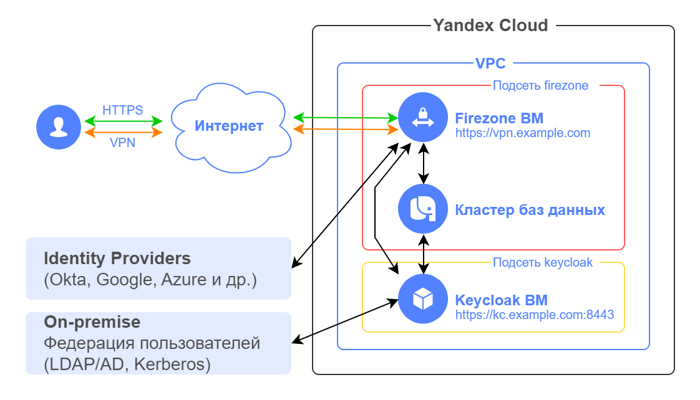

# Remote access VPN на основе WireGuard

## Содержание
- [Описание решения](#описание-решения)
- [Подготовка к развертыванию](#подготовка-к-развертыванию)
- [Развертывание Terraform сценария](#развертывание-terraform-сценария)
- [Настройка Firezone](#настройка-firezone)
- [Проверка работоспособности](#проверка-работоспособности)
- [Требования к развертыванию в продуктивной среде](#требования-к-развертыванию-в-продуктивной-среде)
- [Удаление созданных ресурсов](#удаление-созданных-ресурсов)

## Описание решения

Решение разворачивает в Yandex Cloud облачную инфраструктуру для организации Remote access VPN: защищенного доступа пользователей к облачным ресурсам на основе [WireGuard VPN](https://www.wireguard.com/). Решение поддерживает несколько вариантов популярных Identity Providers для сценариев Single Sign-On пользователей в корпоративной федерации пользователей.

После развертывания решения в Yandex Cloud создаются следующие компоненты:

| Название | Описание |
| ---- | ---- |
| Firezone ВМ | Open-source ПО [Firezone](https://www.firezone.dev/) на основе WireGuard VPN для организации VPN доступа |
| Кластер баз данных | Сервис [Managed Service for PostgreSQL](https://cloud.yandex.ru/services/managed-postgresql) для работы Firezone ВМ и Keycloak ВМ | 
| Keycloak ВМ | Open-source ПО [Keycloak](https://www.keycloak.org/) для Single Sign-On аутентификации пользователей в корпоративной федерации пользователей, например Active Directory |



### Firezone
Firezone - это open-source решение для организации удаленного доступа VPN, обладающее следующими основными возможностями:
- Поддержка современного протокола [WireGuard VPN](https://www.wireguard.com/) с [клиентами](https://www.wireguard.com/install/) для desktop и мобильных устройств
- Аутентификация пользователей:
    - Локальная аутентификация по email и паролю
    - Single Sign-On интеграция с Identity Provider по OpenID Connect (OIDC) или SAML 2.0
    - Многофакторная аутентификация
- Простой веб-интерфейс администратора для настройки и управления пользователями и их устройствами
- Веб-интерфейс пользователя для аутентификации и управления своими устройствами
- Реализация в виде Docker контейнера

Для аутентификации пользователей в Firezone можно использовать несколько вариантов популярных Identity Providers: https://www.firezone.dev/docs/authenticate/. В данном решении в качестве примера выбрана реализация с Keycloak.

Как пользователь подключается к VPN:
1. Пользователь устанавливает на своё устройство [WireGuard клиент](https://www.wireguard.com/install/) 
2. Пользователь получает конфигурационный файл для WireGuard приложения с помощью одного из методов:
    - Администратор Firezone добавляет устройство пользователя в веб-интерфейсе администратора Firezone, скачивает конфигурационный файл для WireGuard и передает его пользователю через защищенный канал;
    - После аутентификации в веб-интерфейсе Firezone пользователь может самостоятельно добавить своё устройство, с которого будет устанавливаться VPN подключение, и скачать конфигурационный файл для WireGuard. Это рекомендуемый метод для использования в Firezone. 
3. Пользователь импортирует конфигурационный файл в WireGuard приложение
4. Пользователь активирует VPN туннель

Инструкция для пользователя по подключению VPN: https://www.firezone.dev/docs/user-guides/client-instructions/

Документация по Firezone: 
- https://www.firezone.dev/docs/
- https://github.com/firezone/firezone 


## Подготовка к развертыванию

1. Перед выполнением развертывания нужно [зарегистрироваться в Yandex Cloud и создать платежный аккаунт](https://cloud.yandex.ru/docs/tutorials/infrastructure-management/terraform-quickstart#before-you-begin)

2. [Установите Terraform](https://cloud.yandex.ru/docs/tutorials/infrastructure-management/terraform-quickstart#install-terraform)

3. Проверьте наличие учетной записи в облаке с правами `admin` на каталог

4. [Установите и настройте Yandex Cloud CLI](https://cloud.yandex.ru/docs/cli/quickstart)

5. [Установите Git](https://github.com/git-guides/install-git)

6. Проверьте квоты в облаке, чтобы была возможность развернуть ресурсы в сценарии:

    <details>
    <summary>Посмотреть справочную информацию по количеству ресурсов, создаваемых в сценарии</summary>

    | Ресурс | Количество |
    | ----------- | ----------- |
    | Виртуальные машины | 2 |
    | vCPU виртуальных машин | 4 |
    | RAM виртуальных машин | 12 ГБ |
    | Диски | 2 |
    | Объем SSD дисков | 110 ГБ |
    | Подсети | 2 |
    | Статические публичные IP-адреса | 2 |
    | Группы безопасности | 2 |
    | Сертификат Certificate Manager | 1 |
    | Зона DNS | 1 |
    | Кластер Managed Service for PostgreSQL | 1 |
    | Объём SSD-хранилища для кластера PostgreSQL | 10 ГБ |
    | Количество vCPU для кластера PostgreSQL | 2 |
    | Объём памяти для кластера PostgreSQL | 8 |    

    </details>


7. Перед развёртыванием решения уже должны существовать следующие объекты:
    - Каталог облачных ресурсов и сеть (VPC) в Yandex Cloud, в которых будут размещаться компоненты решения
    - Домен, который будет использоваться для виртуальных машин Firezone и Keycloak. Этот домен должен быть предварительно делегирован в Yandex Cloud со стороны регистратора домена. Для этого укажите адреса серверов имен Yandex Cloud в NS-записях вашего регистратора:
        ```
        ns1.yandexcloud.net.
        ns2.yandexcloud.net.
        ```


## Развертывание Terraform сценария

1. На вашей рабочей станции склонируйте [репозиторий](https://github.com/yandex-cloud/yc-solution-library-for-security/) `yandex-cloud/yc-solution-library-for-security` из GitHub и перейдите в папку сценария `remote-access-vpn`:
    ```bash
    git clone https://github.com/yandex-cloud/yc-solution-library-for-security.git

    cd yc-solution-library-for-security/network-sec/remote-access-vpn
    ```

2. Настройте окружение для развертывания ([подробности](https://cloud.yandex.ru/docs/tutorials/infrastructure-management/terraform-quickstart#get-credentials)):
    ```bash
    export YC_TOKEN=$(yc iam create-token)
    ```

3. Заполните файл `output.tf` в папке `settings` вашими значениями. Обязательные параметры для изменения отмечены в таблице.

    <details>
    <summary>Посмотреть детальную информацию о заполняемых значениях</summary>

    | Название | Описание | Тип | Пример | Требует изменения |
    | ----------- | ----------- | ----------- | ----------- | ---------- |
    | domain | Доменное имя (второго и первого уровня, разделенное точкой) для виртуальных машин Firezone и Keycloak | `string` | `"example.com"` | да |
    | folder_id | ID каталога для размещения компонент решения | `string` | `"b1gentmqf1ve9uc54nfh"` | да |
    | vpc_id | ID облачной сети для размещения компонент решения | `string` | `"enp48c1ndilt42veuw4x"` | да |
    | trusted_ip_for_mgmt | Список публичных IP адресов/подсетей, с которых разрешено подключение по SSH к Firezone и Keycloak ВМ. Используется во входящем правиле групп безопасности.  | `list(string)` | `["A.A.A.A/32", "B.B.B.0/24"]` | да |
    | **firezone** | | | | |
    | subdomain | Поддомен для Firezone ВМ | `string` | `"vpn"` | |
    | subnet | Значение CIDR подсети для Firezone ВМ | `string` | `"192.168.1.0/24"` |  |
    | vm_username | Имя пользователя для Firezone ВМ | `string` | `"admin"` |  |
    | admin_email | Email администратора (логин) для доступа к веб-интерфейсу администратора Firezone | `string` | `"admin@example.com"` | да |
    | version | [Версия](https://github.com/firezone/firezone/releases) Firezone для развертывания | `string` | `"0.7.32"` | |
    | wg_port | UDP порт для протокола WireGuard | `string` | `"51820"` | |
    | **postgres** | | | | |
    | db_ver | Версия кластера PostgreSQL, используемого для хранения данных Firezone и Keycloak | `string` | `"15"` | |
    | db_user | Имя пользователя в кластере PostgreSQL | `string` | `"dbadmin"` | |
    | db_kc_name | Название базы данных для хранения данных Keycloak в кластере PostgreSQL | `string` | `"kc-db"` | |
    | db_firezone_name | Название базы данных для хранения данных Firezone в кластере PostgreSQL | `string` | `"firezone-db"` | |
    | **keycloak** | | | | |
    | subdomain | Поддомен для Keycloak ВМ | `string` | `"kc"` | |
    | subnet | Значение CIDR подсети для Keycloak ВМ | `string` | `"192.168.2.0/24"` | |
    | port | Номер порта для обращения к Keycloak ВМ по HTTPS | `string` | `"8443"` | |
    | image_folder_id | ID каталога, в котором хранится образ Keycloak | `string` | `"b1g4n62gio32v96mdvrb"` | нет |
    | image_name | Имя образа Keycloak | `string` | `"keycloak"` | нет |
    | vm_username | Имя пользователя для Keycloak ВМ | `string` | `"admin"` | |
    | admin_user | Имя администратора (логин) для доступа к веб-интерфейсу администратора Keycloak | `string` | `"admin"` | |
    | le_cert_name | Имя сертификата для Keycloak в Yandex Certificate Manager | `string` | `"kc"` | |
    | test_user | Тестовый пользователь для проверки SSO в Keycloak и подключения к VPN  | | | |
    | name | Имя тестового пользователя (логин) для проверки SSO в Keycloak | `string` | `"user"` |  |
    | email | Email тестового пользователя, который будет добавлен в Firezone после успешной аутентификации в Keycloak | `string` | `"user@example.com"` | да |
    
    </details>


4. Перейдите в папку `main`
    ```bash
    cd main
    ```

5. Выполните инициализацию Terraform:
    ```bash
    terraform init
    ```

6. Проверьте список создаваемых облачных ресурсов:
    ```bash
    terraform plan
    ```

7. Создайте ресурсы:
    ```bash
    terraform apply
    ```
    Ожидайте окончание создания ресурсов. Обработка запроса на выдачу сертификата в сервисе Let's Encrypt может выполняться до 30 минут. 

8. После завершения процесса terraform apply в командной строке будут выведены URL-адреса для подключения к веб-интерфейсам Firezone и Keycloak, а также учетные записи администраторов Firezone и Keycloak. В дальнейшем эту информацию можно будет посмотреть с помощью команды `terraform output`.

    <details>
    <summary>Посмотреть информацию о развернутых ресурсах</summary>

    | Название | Описание | Пример значения |
    | ----------- | ----------- | ----------- |
    | `firezone_admin_credentials` | Учетная запись администратора Firezone | `"admin_email" = "admin@example.com"`<br>`"admin_password" = "EP!f#YAfdaxd"` |
    | `firezone_url` | URL для веб-интерфейса Firezone | `"https://vpn.example.com"` |
    | `keycloak_admin_credentials` | Учетная запись администратора Keycloak | `"admin_username" = "admin"`<br>`"admin_password" = "Ns?3lvB*HvHD"` |
    | `keycloak_url` | URL для веб-интерфейса Keycloak | `"https://kc.example.com:8443/admin"` |

    Для вывода `sensitive` значения указывайте его в команде `terraform output`, например: `terraform output firezone_admin_credentials`.

    </details>

9. После завершения развертывания Firezone и Keycloak виртуальных машин перейдите в папку `keycloak-config`, чтобы выполнить настройку Keycloak для сценария интеграции Keycloak с Firezone и Single Sign-On.
    ```bash
    cd ../keycloak-config
    ```

10. Выполните инициализацию Terraform:
    ```bash
    terraform init
    ```

11. Проверьте список создаваемых облачных ресурсов:
    ```bash
    terraform plan
    ```

12. Создайте ресурсы:
    ```bash
    terraform apply
    ```

13. После завершения процесса terraform apply в командной строке будет выведена информация для настройки интеграции Firezone и Keycloak, а также учетная запись тестового пользователя для проверки SSO в Keycloak и подключения к VPN. В дальнейшем эту информацию можно будет посмотреть с помощью команды `terraform output`.

    <details>
    <summary>Посмотреть информацию о развернутых ресурсах</summary>

    | Название | Описание | Пример значения |
    | ----------- | ----------- | ----------- |
    | `keycloak_config_for_firezone` | Параметры для настройки интеграции Firezone и Keycloak | `"client_id" = "firezone"`<br>`"client_secret" = "Wxy2nthDXiMD42xmcD2mLgGxtjWbSDDc"`<br>`"discovery_document_uri" = "https://kc.example.com:8443/realms/firezone/.well-known/openid-configuration"` |
    | `test_user_credentials` | Учетная запись тестового пользователя для проверки SSO в Keycloak и подключения к VPN | ` "test_user_name" = "user"`<br>`"test_user_password" = "IfV6OvIKqzzn"` |
    
    Для вывода `sensitive` значения указывайте его в команде `terraform output`, например: `terraform output test_user_credentials`.
    
    </details>

14. После настройки Keycloak с помощью Terraform продолжите [настройку Firezone](#настройка-firezone).


## Настройка Firezone

1. Перейдите в браузере по адресу `https://firezone_url`, где `firezone_url` - вывод команды `terraform output firezone_url` в папке `main`.
2. Войдите в интерфейс администратора Firezone с учетной записью администратор из вывода команды `terraform output firezone_admin_credentials` в папке `main`.
3. Перейдите в раздел `SETTINGS -> Defaults` для изменения настроек по умолчанию.
4. В поле `Allowed IPs` укажите, для каких облачных IP подсетей (укажите через запятую адреса подсетей/маски) VPN клиенты будут направлять трафик в VPN туннель. Пример: `192.168.1.0/24, 192.168.2.0/24`.
5. В поле `DNS Servers` укажите адреса DNS серверов, которые будут использоваться VPN клиентами. Если не планируется переназначения у клиента этих DNS адресов, то удалите информацию в этом поле. Пример: `192.168.1.2, 192.168.2.2`.
6. Также можно изменить параметры по умолчанию для интервала keepalive, размера MTU для VPN клиентов. По умолчанию указан MTU 1280 байт, его можно увеличить до 1440 байт.
7. Нажмите `Save` для применения настроек.
8. Перейдите в раздел `SETTINGS -> Security` для изменения настроек безопасности.
9. Выключите настройку `Allow unprivileged device configuration`, чтобы пользователь не мог изменить через пользовательский веб-интерфейс Firezone сетевые настройки для VPN клиента.
10. Включите настройку `Auto disable VPN`. Это позволит при удалении пользователя в Identity Provider (Keycloak в данном примере) отключить его VPN подключения.
11. Нажмите `Add OpenID Connect Provider` для добавления Keycloak.
12. В разделе `OIDC Configuration` заполните поля:
    - `Config ID`: keycloak
    - `Label`: Keycloak
    - `OIDC scopes`: openid email profile offline_access
    - `Client ID`: firezone
    - `Client secret`: `client_secret` из вывода `terraform output keycloak_config_for_firezone` в папке `keycloak-config` (значение указать без кавычек)
    - `Discovery Document URI`: `discovery_document_uri` из вывода `terraform output keycloak_config_for_firezone` в папке `keycloak-config` (значение указать без кавычек)
    - `Redirect URI`: оставить пустым
    - Включить `Auto-create users` для автоматического добавления пользователей в Firezone после их успешной аутентификации в Keycloak
13. Нажать `Save` в разделе `OIDC Configuration` для применения настроек.


## Проверка работоспособности

1. Установите на своё устройство [клиент WireGuard](https://www.wireguard.com/install/) с сайта WireGuard. Дальнейшие шаги по настройке клиента WireGuard приведены на примере ОС Windows. Для других ОС название элементов интерфейса клиента может отличаться.

2. Перейдите в браузере по адресу `https://firezone_url`, где `firezone_url` - вывод команды `terraform output firezone_url` в папке `main`. Если у вас активна сессия администратора в веб-интерфейсе Firezone, то предварительно выполните `Log Out`. Нажмите `Sign in with Keycloak`. Произойдет редирект на веб-страницу Keycloak для Single Sign-On.

3. Войдите с учетной записью тестового пользователя из вывода команды `terraform output test_user_credentials` в папке `keycloak-config`.

4. После успешной аутентификации в веб-интерфейсе Firezone с тестовым пользователем добавьте устройство, с которого будет устанавливаться VPN подключение. Для этого нажмите `Add Device`.

5. В открывшемся окне можете изменить название устройства и добавить его описание. Нажмите `Generate Configuration`.

6. Появится окно с VPN конфигурацией для устройства. Нажмите `Download WireGuard Configuration` для скачивания файла конфигурации. В приложении WireGuard для Android или iOS можно также отсканировать QR-код с этой страницы для добавления VPN туннеля.

    **Важно:** не закрывайте это окно, пока не скачаете конфигурационный файл или не отсканируете QR-код. После закрытия окна VPN конфигурацию для устройства больше не получится посмотреть в веб-интерфейсе Firezone.

7. Добавьте новый VPN туннель (`Import tunnel(s) from file`) в приложении WireGuard, используя скачанный конфигурационный файл.

8. Активируйте туннель нажатием на `Activate`.  

9. Проверьте на своём устройстве в командной строке с помощью `ping 192.168.1.1` сетевую связность с шлюзом из облачной подсети `firezone`. Вы подключились с помощью VPN туннеля к облачной инфраструктуре.


## Требования к развертыванию в продуктивной среде

- Обязательно смените пароли администратора Firezone и Keycloak
- После проверки работоспособности удалите тестового пользователя в Keycloak и Firezone
- Сохраните private SSH ключ pt_key.pem в надежное место либо пересоздайте его отдельно от Terraform

## Удаление созданных ресурсов

Чтобы удалить ресурсы, созданные с помощью Terraform:
1. Перейдите на вашей рабочей станции в папку `keycloak-config` и выполните команду `terraform destroy`.
2. После этого перейдите в папку `main` и выполните команду `terraform destroy`.

> **Внимание**
> 
> Terraform удалит все ресурсы, созданные в этом сценарии, **без возможности восстановления**.

